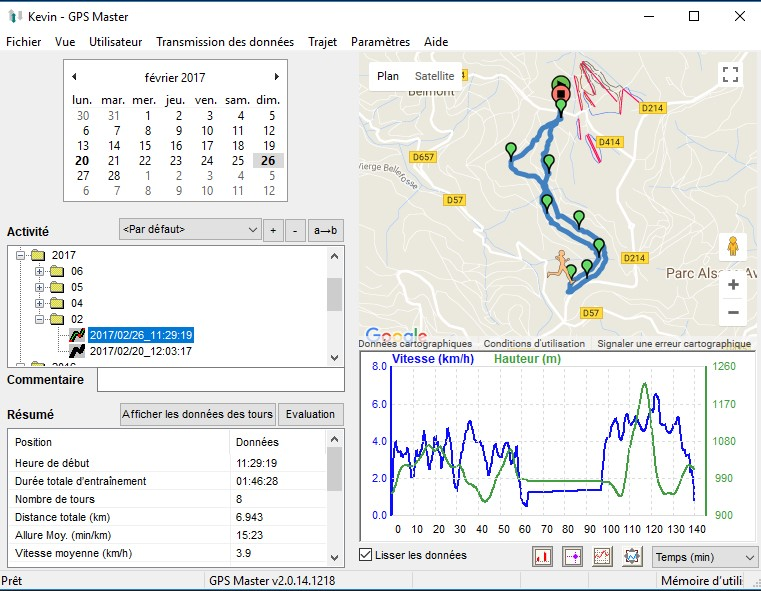
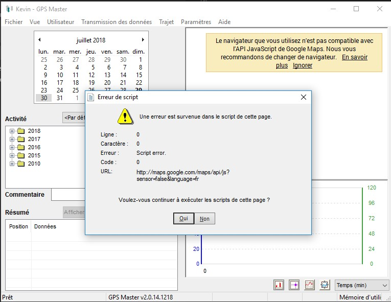
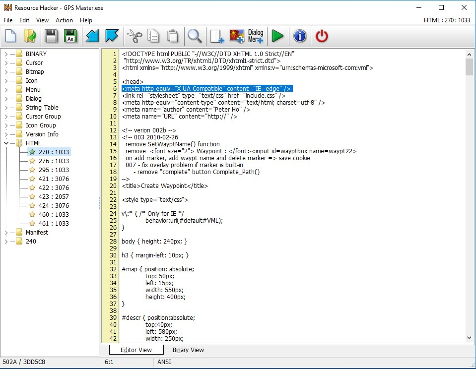

# Correction de code HTML dans les ressources d'une application Windows obsolète

Article écrit le 30 juillet 2018 par [oktomus](http://oktomus.com).

Je vais vous expliquer comment je me suis débrouillé pour corriger un bug bloquant sur un vieux logiciel Windows obsolète.

## Tout d'abord, un peu de contexte

Il y a quelques années, j'ai acquis une montre GPS (de la marque *ASCOS*) avec laquelle un logiciel non-libre est fourni (*GPS Master v2.0.14*). Ce dernier utilise l'*API Google Maps* pour afficher les différents trajets réalisés lors de vos entraînements. Voilà à quoi il ressemble quand ça fonctionne:



Il y a plein de choses que je reproche à cet outil mais l'essentiel des fonctionnalités est là. En revanche, ce logiciel n'est plus mis à jour depuis plusieurs années et est devenu inutilisable à cause de problèmes de compatibilité. On a une pop-up d'erreur qui apparaît à chaque interaction et la carte n'est plus là:



## Pourquoi ça pète !?

C'est une application native qui utilise une *webview*, une instance d'*Internet Explorer* qui tourne dans le logiciel — argh. Le problème courant est que ces *webview* ont tendance à utiliser *Internet Explorer 7* au lieu de la dernière version disponible sur votre PC (aujourd'hui *IE 11*). Et bien évidemment, *IE 7* n'est pas compatible avec l'*API* de *Google Maps*.

Plus d'informations dans la [documentation dev de Google](https://developers.google.com/maps/documentation/javascript/error-messages#unsupported-browsers).

## Ajouter une balise de compatibilité 

Pour régler ce soucis de compatibilité, il suffit d'ajouter une balise `meta` dans le(s) document(s) *HTML* utilisé(s) pour afficher la map dans la *webview*. Cette ligne permet de forcer la version d'*IE* à utiliser:

```
<meta http-equiv="x-ua-compatible" content="IE=edge">
```

Le plus compliqué reste à trouver comment ajouter ce morceau de code dans le logiciel. Dans le cas de *GPS Master* (et de beaucoup d'autres logiciels), vous pouvez voir en ouvrant *GPS Master.exe* avec un éditeur qu'il y a de l'*HTML* directement lisible (assurez vous de faire une copie pour ne pas faire de bêtises). 

Un logiciel est un ensemble de ressources et ici on veut modifier toutes ses ressources HTML. Cela est possible et très facile en utilisant un éditeur de ressources Windows comme [*Resource Hacker*](http://http://angusj.com/resourcehacker/). Ce dernier permet d'ouvrir l'éxécutable, de modifier son contenu et de créer un nouvel éxécutable. Vous allez donc ouvrir le fichier *GPS Master.exe* puis ajouter la ligne ci-dessus dans tous les blocs `head` *HTML*. Si une ligne existe déjà (par exemple: `<meta http-equiv="x-ua-compatible" content="IE=EmulateIE7">`, remplacez-la).

Vous pouvez ensuite compiler les fichiers modifiés (`F5`) et exporter votre nouvel éxécutable (`File > Save As`). En lançant ce dernier, vous n'aurez plus de soucis !



